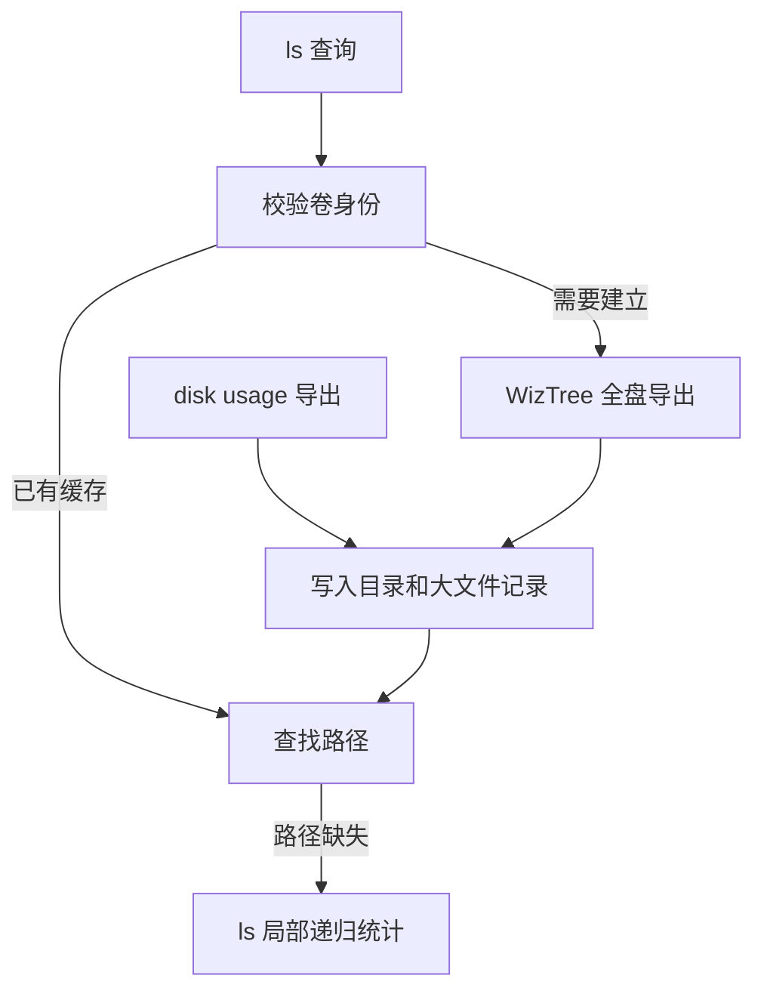

# wz-index：共享目录大小缓存

[ls](ls.md) 与 [disk usage](disk.md#usage占用分析) 共用的内部模块，不向模型注册工具。实现：[wz-index.ts](../../agent/home/extensions/wz-index.ts)。

缓存复用 WizTree 导出结果，减少重复统计。ls 缺少缓存时可触发全盘导出；disk usage 扫描某个路径后，也会将该范围的数据写入缓存。

## 数据结构

| 成员 | 内容 |
|---|---|
| `dirs` | 盘符 → 规范化目录路径 → 聚合字节数 |
| `files` | 盘符 → 文件路径 → 字节数；仅收 ≥1 MB 文件 |
| `identities` | 当前盘符对应的卷身份 |
| `failed` | 当前卷建缓存失败标记 |
| `pending` | 同卷正在进行的建缓存任务，用于合并并发请求 |

路径先转绝对路径，再去尾分隔符并统一大写。UNC 不建立索引。大文件缓存主要用于 stat 失败或系统独占文件大小为 0 时的补查，避免将全部小文件常驻内存。

## 数据流

pi 可能分别编译扩展，普通模块变量不保证共享。因此缓存挂在 `globalThis.__wzIndexStore`，在进程内保持单例。模块提供空默认导出，以兼容扩展加载器。

## 生命周期

1. 复用前读取卷根身份，使用设备标识与根目录创建时间组合识别卷。
2. 身份变化或无法读取时，清除该盘符的目录、文件和失败标记，不复用旧数据。
3. 同卷并发建缓存共用 pending 任务；建缓存先使用局部 Map，完成并再次核对身份后发布。
4. 当前卷失败后不在每次 ls 中重复尝试，避免反复等待扫描超时；换盘或进程重启后可重新尝试。

临时 CSV 使用独立文件名，写入 `wiztree/tmp`，结束时尝试清理。目录创建、导出和解析失败均收敛为建缓存失败，ls 可继续降级。

## 取舍与限制

| 决策 | 原因或代价 |
|---|---|
| 进程内 Map，不持久化数据库 | 减少便携工具的持久写入；重启需要重建 |
| 仅接收 WizTree 导出，不缓存 Node 降级统计 | 防止预算或权限造成的下界长期污染缓存 |
| 不按文件变化实时刷新 | 减少监听成本；同卷内新增、删除、修改可能暂不反映 |
| 不索引 UNC | 无本地卷身份和 MFT 快速路径，交给递归统计 |
| 不设置淘汰上限 | 实现简单，但内存随扫描过的卷和目录数增长 |

`wiztree-index` 只表示命中该缓存，不证明数据来自 NTFS MFT。FAT32/exFAT 上的 WizTree 导出也可能进入缓存；来源口径见 [disk](disk.md)。缓存是扫描快照，不是实时文件系统真值。
